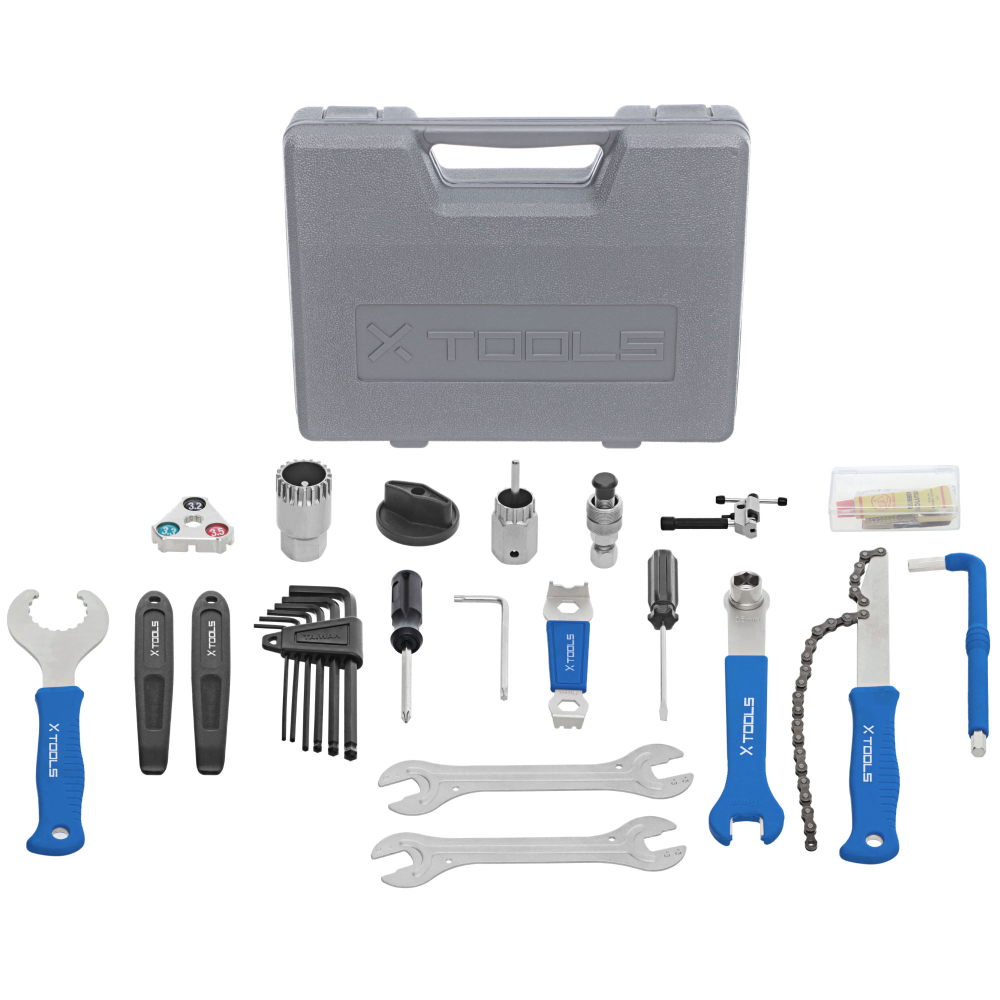

Born in the back of a bike shop in Saint Paul,
Minnesota in 1963, Park Tool has grown to be the
world’s largest bicycle tool manufacturer. We
have never forgotten our roots and are proud to be
the tool brand of choice for both home and shop
mechanics around the world.
Making bicycle tools is our only job. We design,
engineer, manufacture, assemble, package and
ship more than 500 tools from our factory just miles
from the bike shop where it all started. From our
first product, the PRS-1 Bicycle Repair Stand, to
our latest, we continue to build high quality tools
that save time, save money and simply help to get
the job done right, every time. Moving forward,
we endeavor to remain in the forefront of bicycle
technology, developing and refining the tools of the trade.
